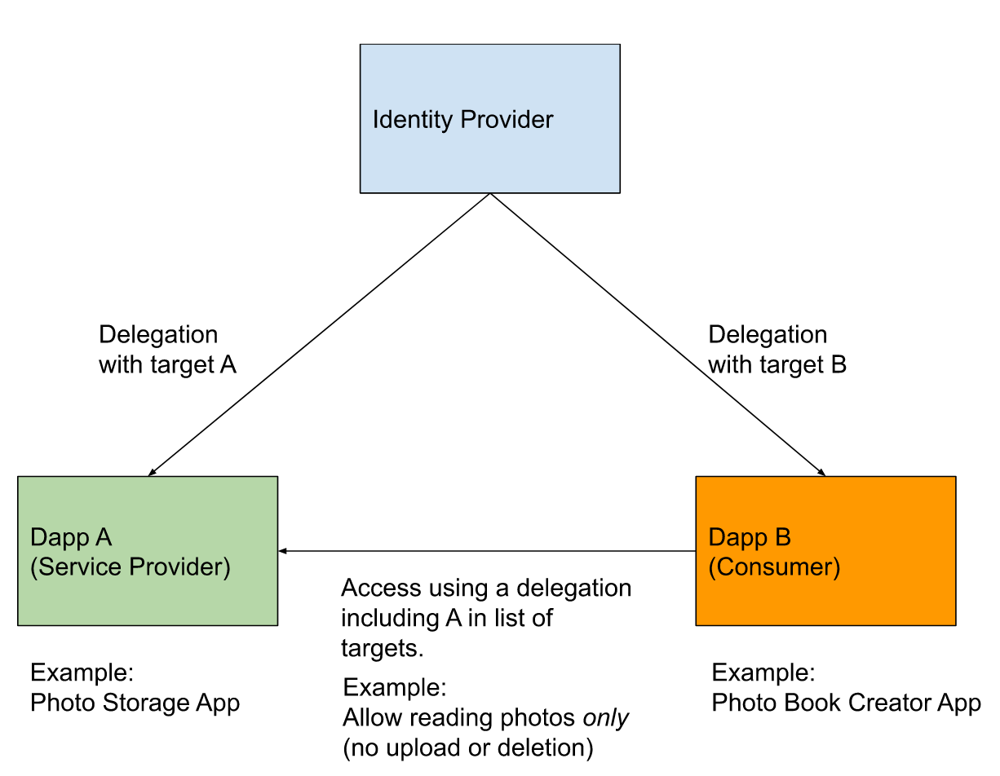
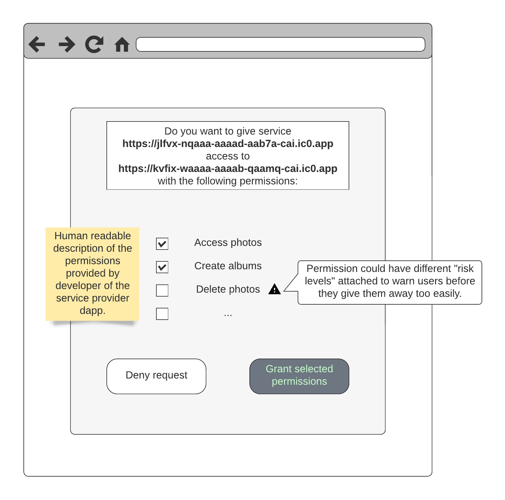

# Interoperability of Services using User Identity

## Introduction
This is a call for feedback on the topic of bringing interoperability and composability together with the privacy-friendly design of Internet Identity and other identity providers. This is an initiative of the Identity and Authentication Working Group. Community members are encouraged to actively participate and take part in the monthly working group sessions.

This is a live document and will be expanded continuously as we go along the process outlined below.

## Goal
The goal is to **derive the requirements, a solution design and ultimately an MVP implementation** to address the most pressing needs of the community regarding interoperability & composability with respect to identity on the IC.

## Process
This feature will go through the following process:
1. Validate the problem statement (current step)
2. Gather requirements from the community
3. Form consent in the Identity and Authentication Working Group on a consolidated set of MVP requirements.
4. Start process to find possible solutions to address the MVP requirements.
5. Form consent in the Identity and Authentication Working Group on an implementation ready MVP specification.
6. Create an NNS proposal to vote on whether the MVP spec should be accepted as a standard.
7. If the NNS proposal is accepted: implement the specification in the IC (as required to unblock identity providers).

### Forming Consent
We use GitHub to organize our collaboration but also want to keep the process lightweight and easy to participate in. As such we can use issues to track and discuss concerns community members might have. The goal should be to reach consent by dealing with all issues raised in a manner acceptable to all participants.

If this is not possible in a reasonably efficient way the working group may need to revise this process.

## Problem description

The problem can be phrased slightly differently depending on the type of identity provider issuing the delegations:
* if application specific principals are used (and not using the delegation target): The goal of this project is to provide means for users to allow services limited access to other services using their application specific principal. 
* if global principals are used (in conjunction with delegation targets): The goal of this project is to provide means for users to allow additional delegation targets with limited permissions. 

## Permission Request Flow

The following is a flow loosely based on the OAuth 2.0 / OpenID Connect flows that are generally used by Web 2.0 applications. A flow like this will be familiar to most users.
Nonetheless, it should only be used as a starting point and can be shaped to the needs of the community.

## Consent Screen
This is a mock-up of what a consent-screen could look like. The goal should be to clearly communicate to the users what the implications of consenting to permission delegation are.

Identity providers are free to implement this screen as they wish. It is included here as a starting point for the discussion regarding user interaction.

## Problem Parameters
In order to solve this problem, there are a few parameters that need to be specified in the architecture:
* How to specify permissions
  * Format
  * Semantics
  * Human readable descriptions
    * How to deal with internationalization
* How to issue credentials
* Credential validity durations
  * For a single session
  * For a longer time period
* How to revoke permission delegations / credentials
* Which component verifies the credential matches the permission given on a specific canister call
  * The service provider dapp
  * The replica
* How to collect consent from the user
* How to handle revocation of credentials
* How to handle unlinkability between principals
  * It is likely that unlikability cannot be maintained in the general case: Consider a service provider that allows delegation of a permission that gives consumer access to a function that reveals the caller principal. However there might be a means to mitigate this issue.
* Retain extensibility of the protocol for further development
  * E.g. allow delegation of capabilities between canisters

### Further considerations
* What if the canister call (consumer → service provider) requires payment?
  * Out of scope, needs to be handled by the consumer
  * Provide means to allow users to pay for the access
* Do we need to maintain compatibility with Web 2.0 services
  * for consumers
  * for service providers
* Given an existing infrastructure dapp such as Internet Identity or the NNS dapp:
  * expected set of permissions

## Requirements
List of requirements gathered so far:

| Requirement | Description | Source | MVP Scope (Y/N) |
|-------------|-------------|--------|-----------------|
|             |             |        |                 |
|             |             |        |                 |

